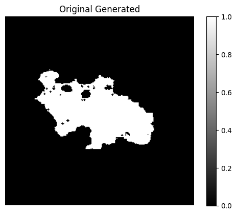

# AI Tools for Wildfire Forecasting

**GitHub Repository by Team Atlas**: Tim Du, Quan Gu, Jiangnan Meng, Shiyuan Meng, Daniel Seal, Anna Smith, Maddy Wiebe, Xuan Zhan

## Table of Contents

1. [ Introduction ](#intro)
2. [ Repository Structure ](#structure)
3. [ Installation ](#install)
4. [ Dataset ](#data)
5. [ RNN ](#obj1)
6. [ VAE ](#obj2)
7. [ Data Assimilation ](#obj3)
8. [ Conclusion ](#conclusion)
9. [ Testing ](#tests)
10. [ Documentation ](#docs)
11. [ Licence ](#licence)

<a name="intro"></a>

## Introduction

Predicting wildfires is essential for protecting human life, property, and the environment. This project aims to develop a comprehensive system that predicts wildfire behavior using Recurrent Neural Networks (RNN), Generative AI, and data assimilation techniques. The system uses historical wildfire data and satellite imagery to enhance prediction accuracy and provide actionable insights.

In this repository, we are using model and observation data from the 2018 California Ferguson wildfire. The models developed in this project were designed to help forecast the evolution of this hostorical wildfire in order to develop methods to better forecast future wildfires.

<a name="structure"></a>

## Repository Structure

```acds3-wildfire-atlas/
├── src/
│ ├── forecasting
│ │ └── ...
│ ├── generative
│ │ └── ...
│ ├── notebooks
│ │ ├── forecasting
│ │ │ └── Task1.ipynb
│ │ └── generative
│ │   └── FCVAE_gridsearch.ipynb
│ │   └── FCVAE_Tuning.ipynb
│ │   └── forecasting
│ └── tests
│   └── ...
├── setup.py
├── requirements.txt
├── License.md
└── README.md
```

<a name="install"></a>

## Installation

1. To clone the GitHub repository, run the following code in your terminal at a chosen directory:

   ```bash
   git clone https://github.com/yourusername/acds3-wildfire-atlas.git
   ```
2. Navigate to the cloned project directory:

   ```bash
   cd acds3-wildfire-atlas
   ```
3. Create the atlas conda environment (`python 3.11` or higher):

   ```bash
   conda create -n atlas  python=3.11
   ```
4. Activate the conda environment:

   ```bash
   conda activate atlas
   ```
5. Navigate to the root directory (contains the `\src` directory) and install the package:

   ```bash
   pip install -e .
   ```

   Note: The package is installed as an editable using `-e` so that any changes will be automatically updated.
6. To see the installed package, run:

   ```bash
   pip list
   ````

<a name="data"></a>

## Dataset

Four datasets were used to train the models in this repository:

`Ferguson_fire_train.npy`: Dataset of 12500 wildfire model generated images. The dataset represents 125 indiviudal wildfires, each 100 images long. The data is ordered sequentially, simulating the evolution of the individual fires.

`Ferguson_fire_test.npy`: Dataset of 5000 wilfire model generated images. The data resembles the training data, but can be set aside and used for testing. 50 individual wildfires captured in the data, each 100 images in length, ordered sequentially to show the evolution of fires.

`Ferguson_fire_background.npy`: Dataset containing 5 model generated images. These images were generated to simulate one wildfire captured in the `Ferguson_fire_obs.npy`, and have the same timesteps as the satellite observation data. These images can be assimilated with the observation data.

`Ferguson_fire_obs.npy`: Satellite observation data of one wildfire captured in 5 images. Images ordered chronologically, demonstrating the evolution of the fire. Can be used to assimilate the `Ferguson_fire_background.npy` data.

<div align="center">
   
</div>

<hr style="border: none; border-top: 2px solid fire;"/>

<a name="obj1"></a>

# ⏳ Wildfire Surrogate Model using RNN

Use a recurrent neural network to train a surrogate model of a wildfires predictive model.

### Notebook

In the `src/notebook/wildfire_forecastin_task1.ipynb` file, we demonstrate the entire workflow of our model. First, we show how to preprocess the data and train the model. Then, we illustrate how to generate prediction images and compare them with the real images. At the end of the notebook, we discuss our previous model attempts, explain why we discarded them, and detail the process of adjusting the model's hyperparameters.

We showcase the final performance of our model through generating images. Overall, the model achieved an average MSE of 0.0014 on the test dataset, an MSE of 0.0124 on the background dataset, and an MSE of 0.0125 on the obs dataset.

## RNN Model Architecture

<div align="center">
  
</div>

`Simple convolution layer-CNN (CAE-Encoder)`: The input image sequence is passed through a simple convolutional neural network for feature extraction and output feature maps. The structure is similar to CAE encoder.

`Convolutional LSTM layer (ConvLSTM)`: Two convolutional LSTM units are used to process the extracted feature maps to capture the spatiotemporal dependencies in the time series.

`Deconvolution layer-ConvTrans (CAE-Decoder)`: The output of the LSTM layer is passed through a series of deconvolution (upsampling) layers to restore it to the size of the original image.

## Usage

#### Initialize the RNN model:

`input_dim`: The number of channels of the data passed into ConvLSTM.

`hidden_dim`: The changes in the number of channels after each layer of ConvLSTM are stored in a list. There should be as many elements in the list as there are layers of ConvCell.

`kernel_size`: CNN kernel in ConvLSTM.

`num_layers`: The number of ConvLSTM cell in ConvLSTM part.

```python
# create the model
input_dim = 64
hidden_dim = [128, 64]
kernel_size = (3, 3)
num_layers = 2
model = ImageSequencePredictor(input_dim, hidden_dim, kernel_size, num_layers)
```

#### Create the Dataset:

`sequence_length`: The number of images in the input.

`step`: The time step between each input images.

```python
data_file_path = 'Ferguson_fire_train.npy'
dataset = CustomDataset(data_file_path, sequence_length=4, step=9)
```

#### Train the model:

```python
# Training
num_epochs = 10
train_model(model, train_loader, test_loader, criterion, optimizer, num_epochs, device)
```

#### Generate the images:

`start`: Because the test data set has 5,000 pictures, the start parameter can select which picture to start with as the input of the model.

`num_inputs`: The number of input images required by the model has the same meaning as the sequence_length parameter.

```python
# Testing and Generate 
num_inputs = 4
start = 589
test_output, background_output, obs_output = generate(model, test_data_path, back_data_path, obs_data_path, start, num_inputs, device)
```

# 🔥 Wildfire Surrogate Model using VAE

For this section we use a generative AI method to train a wildfire model. We chose to use a VAE to generate wildfire images. Our best model was a fully connected linear VAE, and we did a lot to fine tune this network. Our notebooks that are in this folder: ```src/notebooks/generative``` detail this work as well as demonstrate function usage and show the work we did toward finding a high performing generative model.

## Model Notebooks

`FCVAE_Tuning.ipynb` This notebook sets up a baseline model with our VAE class and plot the reconstructed images. The notebook then shows how different metrics can be tuned, such as learning rate, activation functions and even adding a beta warmup. These parameters can easily be adjusted using our class and functions. The architecture, performance, number of epochs and additional comments are provided in the notebook and can also be seen below.

<div align="center">

</div>

`FCVAE_gridsearch.ipynb` This notebook details a more robust grid search for parameter tuning. Given the structure of our linear VAE class, many of these adjustments can be made easily within the model function parameters, or in the training function parameters. We look at modifying the number and size of the hidden layers, the latent dimension, batch size and learning rates. This code can be easily replicated to try different parameters, or more parameters.

<div align="center">

</div>

`vae_image_selection.ipynb` This notebook shows how, given a trained model, we can generate a 'best image' from a batch of images. The selection is based on certain criteria defined in the notebook, allowing us to identify and select the highest quality generated images for Data Assimilation. We did some image processing within the function we used to do the comparison of generated models to the satellite images. This included a gaussian smooth as well as a SSIM calculation on top of the MSE calculation to really produce images that were as close to the satellite as we could get them. Below is an example of one run of hte function to produce a 'best image'.

<div align="center">

</div>

`FCVAE_final_training.ipynb` This notebook trains the final model we chose with the entire 17,500 wildfire sequenced images and is run for a total of 100 epochs. We plot the training loss as well as the original and reconstructed images with their difference (using a custom function) to show how well this model did. The final model used ReLU as the activation with a dip in the MSE() while training due to the learning rate scheduler that was added. Our MSE on training was ```54.648```.

<div align="center">

</div>

`CNNVAE_exploration.ipynb` This notebook explores a convolutional VAE model which we found not to perform as well as our linear VAE. The training took longer, and the images ended up with more of a blur surrounding than those we reproduced with our final VAE. The model did introduce a KL warm up and a learning rate scheduler to try and make it more robust. This outlines using our CNN VAE class, which can also be adjusted and altered.

<div align="center">

</div>

<a name="obj3"></a>

## ⚖️  Data Assimilation

Perform Data Assimilation with the results of RNN model and  generative model. Data assimilation is performed in a reduced space.

## PCA Compression

To prepare for data assimilation, we first reduce the dimensionality of the data using PCA.

### Train PCA Model

We train a PCA model on the provided training data. Important parameters include:

- `train_path`: Path to the numpy file containing training data.
- `obs_path`: Path to the numpy file containing observational data.
- `background_path`: Path to the numpy file containing background data.
- `n_components`: Number of principal components for PCA. Defaults to 256.
- `obs_index`: Index of the specific observation from the dataset. Defaults to -1 (last observation).
- `background_index`: Index of the specific background from the dataset. Defaults to -1 (last background).

### PCA Training Example

```python
from src.assimilation.train_pca import TrainPCA

# Initialize TrainPCA object
pca_trainer = TrainPCA(
    train_path='path_to_training_data.npy',
    obs_path='path_to_observational_data.npy',
    background_path='path_to_background_data.npy',
    n_components=256,
    obs_index=-1,
    background_index=-1
)

# Print MSE
pca_trainer.print_mse()

# Save PCA model
pca_trainer.save_model('pca_model.pkl')

# Get reduced data
obs_reduced, background_reduced = pca_trainer.get_reduced_data()

# Decompress data
obs_decompressed, background_decompressed = pca_trainer.decompress_data()

# Plot images
pca_trainer.plot_images()
```

</a>

## CNN Autoencoder Compression

Another method for compressing the data involves using a Convolutional Neural Network (CNN) Autoencoder.

### Train CNN Autoencoder

We use a CNN Autoencoder to perform dimensionality reduction on the data. Important parameters include:

- `train_path`: Path to the numpy file containing training data.
- `test_path`: Path to the numpy file containing test data.
- `back_path`: Path to the numpy file containing background data.
- `obs_path`: Path to the numpy file containing observational data.
- `device`: Device to run the model on (default is 'cpu').

### Key Features of CNN Autoencoder

- **Encoder**: Uses convolutional layers with ReLU activation and MaxPooling for downsampling.
- **Decoder**: Uses transposed convolutional layers with ReLU activation and Sigmoid for upsampling.

#### Training the Model

The model is trained using Mean Squared Error (MSE) loss and the Adam optimizer.

epoch: 200, batch size = 256, learning rate = 0.001

#### Computing MSE

**mse_reduced_before_da**：Difference between generated data and original data in reduced place

**mse_reduced_after_da**: After using data assimilation, the difference between generated data and original data in reduced place

**mse_full_before_da**: Difference between generated data and original data in physical place

**mse_full_after_da**: After using data assimilation, the difference between generated data and original data in physical place

### Original and Reconstructed Images

We compress and then decompress the observational and background data using the trained PCA model to demonstrate the effectiveness of the dimensionality reduction.

## Data Assimilation Steps

1. **Calculate Error Covariance Matrices R and B**:
   We calculate the error covariance matrices from the reduced space representations of the observational and background data. Important parameters include:

   - `data_R_path`: Path to the numpy file used to calculate the error covariance matrix R.
   - `data_B_path`: Path to the numpy file used to calculate the error covariance matrix B.
   - `W_R`: Weight for the error covariance matrix R. Defaults to 1.
   - `W_B`: Weight for the error covariance matrix B. Defaults to 1.
   - `latent_shape`: The size of the latent space after data compression. Defaults to 256.

   **Formulas for R and B Calculation**:

   R = cov(X<sub>R</sub>) + λ<sub>R</sub> I

   B = cov(X<sub>B</sub>) + λ<sub>B</sub> I

   where `cov(X)` denotes the covariance matrix of `X`, and λ is the weight parameter.
2. **Perform Data Assimilation**:
   Data assimilation involves computing the Kalman Gain matrix, determining the delta (difference between reduced observations and background), and updating the background using these values.

### Data Assimilation Example

```python
from src.assimilation.data_assimilation import DataAssimilation

# Initialize DataAssimilation object
da = DataAssimilation(
    single_image_path='path_to_single_image.npy',
    model=pca_trainer.pca,
    obs_path='path_to_observational_data.npy',
    data_R_path='path_to_data_R.npy',
    data_B_path='path_to_data_B.npy',
    obs_index=0,
    W_R=1,
    W_B=1,
    latent_shape=256
)

# Perform data assimilation
da.assimilate()

# Get assimilated data
assimilated_data = da.get_assimilated_data()

# Print MSE before and after assimilation
da.print_mse()

# Plot images
da.plot_obs_image()
da.plot_predicted_image()
da.plot_fixed_predicted_image()
```

### MSE and Resulting Images

**Mean Squared Error (MSE)** using PCA:

- MSE before data assimilation in reduced place: 3.9552
- MSE after data assimilation: in reduced place:  0.0300
- MSE before data assimilation in pyhsical place: 0.0087
- MSE after data assimilation: in physical place:  0.0003

**Resulting Images**:

<div style="text-align: center;">
  <div style="display: inline-block; margin: 10px;">
    <p><strong>Original Image</strong>:</p>
    
  </div>
  <div style="display: inline-block; margin: 10px;">
    <p><strong>Reconstructed Image</strong>:</p>
    
  </div>  
  <div style="display: inline-block; margin: 10px;">
    <p><strong>Updated Image After Data Assimilation</strong>:</p>
    
  </div>
</div>

**Mean Squared Error (MSE)** using CAE:

- MSE before data assimilation in reduced place: 0.2994
- MSE after data assimilation: in reduced place:  0.1010
- MSE before data assimilation in pyhsical place: 0.0089
- MSE after data assimilation: in physical place:  0.0037

**Resulting Images**:

<div style="text-align: center;">
  <div style="display: inline-block; margin: 10px;">
    <p><strong>Original Image</strong>:</p>
    
  </div>
  <div style="display: inline-block; margin: 10px;">
    <p><strong>Reconstructed Image</strong>:</p>
    
  </div>
  <div style="display: inline-block; margin: 10px;">
    <p><strong>Updated Image After Data Assimilation</strong>:</p>
    
  </div>
</div>

<a name="tests"></a>
## Testing

This repository includes several tests, which you can use to check its operation on your system. When you are in the 'atlas' environment, the tests can be run by entering this code in terminal:
```
python -m pytest src/tests
```
The tests do cover the basics, although more robust testing is lacking from the current set up, and something that can be improved upon in the future.

<a name="docs"></a>
## Documentation

To generate documentation, ...

<a name="license"></a>

## License

This project is licensed under the MIT License - see [License.md](License.md)
